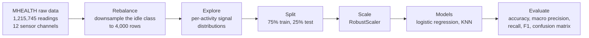

# Human Activity Recognition from Wearable Sensors

Classifies what a person is doing (walking, cycling, climbing stairs, lying down and eight other activities) from raw accelerometer and gyroscope readings, using the MHEALTH dataset. A k-nearest-neighbours classifier on scaled sensor readings reaches 97% accuracy.

`Python` `scikit-learn` `pandas` `NumPy` `Matplotlib` `seaborn`

## Why this exists

Activity recognition is the base layer for health monitoring, fall detection and fitness tracking. The interesting question in this notebook is how far a simple, well-prepared classical model can go on raw sensor readings before a deep model is needed.

## Pipeline



| Step | Detail |
| --- | --- |
| Data | Accelerometer and gyroscope readings from the left ankle and right arm (12 channels), labelled with one of 12 activities or "none" |
| Rebalancing | The unlabelled "none" class makes up most of the raw recording, so it is sampled down to 4,000 rows. The working set is 347,195 readings |
| Features | The 12 raw channels. The subject identifier is dropped |
| Scaling | `RobustScaler`, fitted on the training split only |
| Models | Logistic regression as the linear baseline, then KNN with k from 1 to 10 |
| Metrics | Accuracy plus macro-averaged precision, recall and F1, so small classes count as much as large ones |

## Results

Test-set scores from the notebook:

| Model | Accuracy | Precision | Recall | F1 |
| --- | ---: | ---: | ---: | ---: |
| Logistic regression, scaled | 64.5% | 57.2% | 56.8% | 55.5% |
| KNN (k = 5), unscaled | 92.8% | 91.2% | 86.6% | 87.4% |
| KNN (k = 5), scaled | 96.8% | 96.4% | 91.2% | 92.4% |
| **KNN (k = 1), scaled** | **97.2%** | **95.5%** | **92.7%** | **93.7%** |

Two things stand out. A linear boundary cannot separate these activities, which is why logistic regression stalls near 64%. And scaling matters for a distance-based model: the same KNN gains four points of accuracy and five of F1 once the channels share a scale.

## Running it

```bash
pip install pandas numpy scikit-learn matplotlib seaborn statsmodels jupyter
jupyter notebook Human_Action_Detection.ipynb
```

The notebook reads `mhealth_raw_data.csv.zip` from its own folder. The dataset is not included in the repository. MHEALTH is published by the UCI Machine Learning Repository.

## Limitations and next steps

- The split is random across individual readings, so readings from the same person and the same activity bout appear in both training and test data. A split that holds out whole subjects would be a stricter test and would likely score lower.
- Each reading is classified on its own. Windowing the signal and adding features such as mean, variance and dominant frequency would use the temporal structure.
- A 1D CNN or LSTM over windows is the natural comparison once windowing is in place.

---

Built by [Yogdeep Benchimath](https://github.com/Yogdeep2004). More work on the [portfolio](https://deepwork-systems.vercel.app/).
